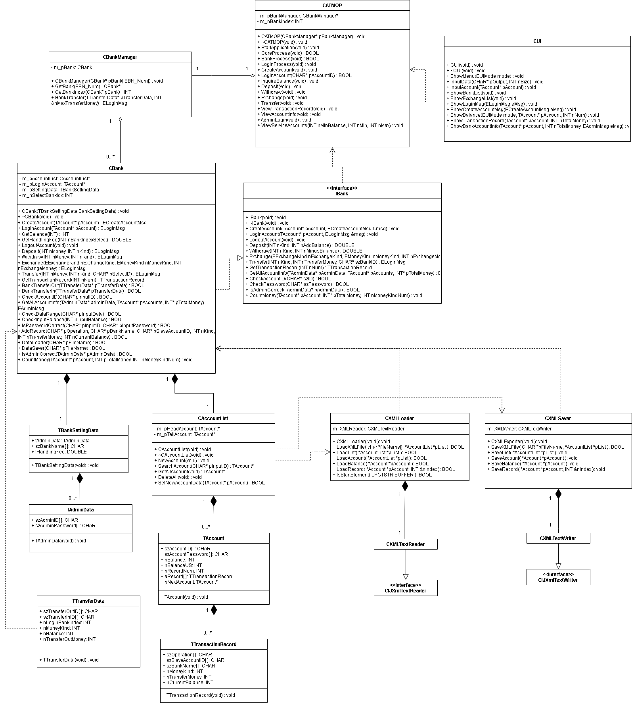

  
# [銀行ATM系統模擬]

## 專案概述
專案在模擬銀行ATM系統，提供帳戶開戶、登入、管理者模式、存款、提款、轉帳及跨行轉帳等功能。系統支援多個銀行（玉山、中國信託、花旗、第一銀行、台新銀行），並使用XML格式儲存交易紀錄。專案採用物件導向設計，結合Linked List管理帳戶資料，並實現動態記憶體管理和嚴謹的輸入驗證，展示C++程式設計、資料結構與系統設計的能力。

## 使用書說明
1. 程式檔案：side project(sln) 和 side project(file)
1. 啟動程式後，主選單顯示退出（0）或選擇銀行（1-5：玉山、中國信託、花旗、第一銀行、台新銀行）。  
2. 選擇銀行後，進入功能選單：  
   - 開戶（1）：輸入帳號、密碼、開戶金額。  
   - 登入（2）：輸入帳號與密碼。  
   - 管理者模式（3）：輸入管理者憑證，查看帳戶資訊。  
   - 存款/提款（4-5）：輸入金額，記錄交易。  
   - 轉帳（6）：選擇同銀行或跨行轉帳，輸入目標帳戶與金額。  
3. 交易紀錄儲存為XML格式，管理者模式可查看所有交易明細。

## 程式架構圖(UML)

## 規格說明
基礎功能
   - 帳戶開戶：輸入6位數帳號、密碼及開戶金額，驗證後儲存至鏈結列表（CAccountList）。
   - 用戶登入：驗證帳號與密碼，確保安全存取。
   - 管理者模式：輸入管理者帳號與密碼，顯示所有帳戶資訊及總餘額。

進階功能
   - 存款與提款：支援存款與提款操作，記錄交易明細。
   - 交易紀錄：列出帳戶的交易歷史，格式為「[次數][操作][對象][交易金額][貨幣][餘額]」。
     
多銀行支援與轉帳
   - 多銀行選擇：支援玉山與中國信託等多銀行操作，一個用戶可在不同銀行擁有帳戶。
   - 同銀行轉帳：實現同一銀行內帳戶間的資金轉移。
     
跨行轉帳 
   - 跨行轉帳：支援不同銀行間的帳戶轉帳，包含手續費：
     
跨銀行轉帳手續費表       | 玉山| 中信| 花旗
:-----------------: | :---------:| :---------:| :---------:
玉山 | 0%| 5%| 10%
中信  | 5%| 0% | 15%
花旗   | 10% | 15%| 0% 

   - 交易紀錄：轉帳雙方帳戶均記錄交易明細。
     
XML資料處理
   - 使用XML Reader/Writer處理交易資料，支援讀取與寫入XML檔案，確保資料持久化。
